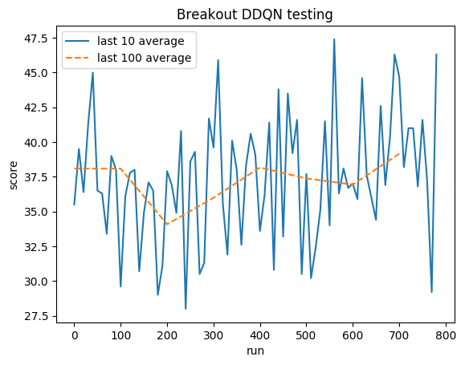

# Breakout (Atari)
We used Double Q-Learning (DDQN) to learn to play Breakout via pixels as input.

## Purpose
This project is used for EEL 4660.

## Usage

1. Clone the repo.
2. Go to the project's root folder.
3. Install required packages`pip install -r requirements.txt`.
4. Launch atari. I recommend starting with help command to see all available modes `python atari.py --help`.

## DDQN
### Hyperparameters
	* GAMMA = 0.99
	* MEMORY_SIZE = 900000
	* BATCH_SIZE = 32
	* TRAINING_FREQUENCY = 4
	* TARGET_NETWORK_UPDATE_FREQUENCY = 40000
	* MODEL_PERSISTENCE_UPDATE_FREQUENCY = 10000
	* REPLAY_START_SIZE = 50000
	* EXPLORATION_MAX = 1.0
	* EXPLORATION_MIN = 0.1
	* EXPLORATION_TEST = 0.02
	* EXPLORATION_STEPS = 850000

### Model Architecture
Deep Convolutional Neural Network by [DeepMind](https://www.cs.toronto.edu/~vmnih/docs/dqn.pdf)

	* Conv2D (None, 32, 20, 20)
	* Conv2D (None, 64, 9, 9)
	* Conv2D (None, 64, 7, 7)
	* Flatten (None, 3136)
	* Dense (None, 512)
	* Dense (None, 4)
	
	Trainable params: 1,686,180

### Performance
After 5M of steps (**~40h** on GTX 1060 GPU):

#### Breakout

*Training:*

Normalized score - each reward clipped to (-1, 1)

*Testing:*
[YouTube Video](https://www.youtube.com/watch?v=kOi7zzJIpC0)

1/3 of the Youtube Video

2/3 of the Youtube Video

3/3 of the Youtube Video

Human average: **~31**

DDQN average: **~37**

This repository was forked from: https://gsurma.github.io
